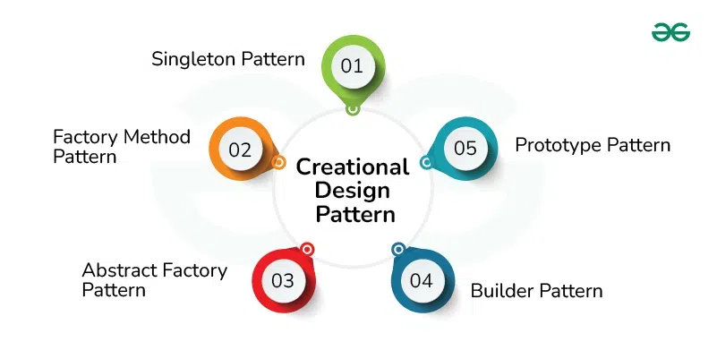
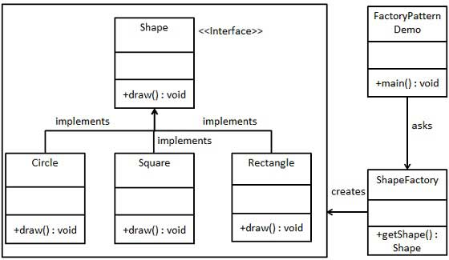

 

Design patterns are general solutions that can be reused to solve a common problem in software design. Design patterns are especially useful to beginners because they 

Design patterns can be applied to object-oriented programming, but they can also be applied to UI, databases, testing, and much more! I think that this is beneficial because if someone is struggling with a solution, design patterns can make solving a problem a lot easier. A complex solution can be simplified and potentially be more efficient. Having a standardized approach to looking at common problems (by using design patterns) can be very effective. When people improve at solving simpler solutions in the most effective way possible, it can reinforce those patterns when solving more complex problems. Doing so allows the solutions to more complex problems be efficient while maintaining effectiveness. Design patterns encourage more structure and consistency among code. I appreciate this because it tends to keep things more organized. Orginization is important, especially when working with many people on a project.

Design patterns have:
- a name that is meaningful
- a description of the problem and when to apply the pattern
- a description of the solution (the classes/objects/etc. that are used and the relationships between them)
- any potential consequences of using this design pattern

One type of design pattern that I have used a lot, especially when I first started learning about programming, is the Factory Pattern. A very common problem I remember trying to solve is having a Shape class with multiple subclasses, where the subclasses are supposed to be used for objects that are different "shapes". I think that using the Factory Pattern helps keep code more clean and efficient.

