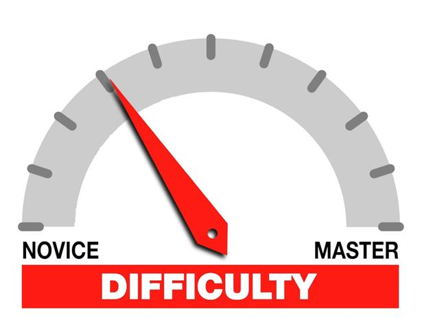

## The Importance of Smart Questions

Asking questions in a "smart" way is significant because people need to understand what is being asked in order to help find a solution. It also allows the solution to be found faster because if you're communicating effectively people won't have to puzzle together what is being asked, which could cause annoyance and avoidance of the question altogether. Asking questions in a *concise* way is also important. No one wants to spend 15 minutes reading a wall of text and code that could have take them 30 seconds to read if it was written more clearly. Speaking of walls of code, I came across one post on StackOverflow that had a snippet of code attached that was a whopping *139* lines long (yes, I pasted it into a text editor to find out...). I don't know if that even deserves to be called a snipped of code since they essentially put their whole program. The OP was having issues with their JavaScript program because they tried assigning the `id` attribute to multiple elements. They were hit with a "Use a `class` attribute instead [of] `id`, rtfm!". Overall, the post was poorly written and the code "snippet" was excessively long, also OP seemed to do very little research about the issue they were having.

