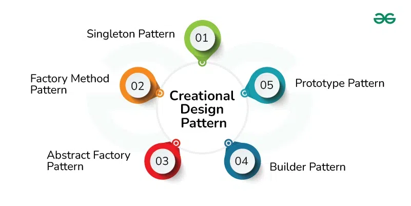

 

## Introduction

Some concepts that I have learned from taking Software Engineering that I know will help me in future courses and beyond are: coding standards, design patterns, and ethics in software engineering. I have learned a lot throughout this semester, and this course contributed to a lot of learning... and a lot of struggle. Learning about the above three concepts was really fun and intriguing to me, but I also really liked taking Software Engineering 1 because I enjoy HTML/CSS and I had a lot of enjoyment using Bootstrap and React. I think that the flexibility to create interactive, and appealing websites/applications is very fun and I feel like I learned a lot this semester, but there is still so much more for me to learn!

## Coding Standards

Coding standards was one concept that I felt like I really enjoyed learning about because of the organization it provides. I also really liked learning about this module because I believed that this could be applied outside of Software Engineering. Coding Standards are rules that developers follow to keep code cleaner and more organized. It is a practice implemented to standardize code, making it more readable, organized, and even efficient. By implementing coding standards, developers can find issues faster. Otherwise, it could take much longer to find issues. Coding standards are a diverse ruleset, for example - indentation spacing, naming conventions (variables, classes, etc.), commenting, structure of code, and much more! This was one of the most interesting modules to me because I am excited to implement this outside of Software Engineering, and I believe that developers use this quite often in their day-to-day.

When working on the final project, it became evident to me how people see things and work differently, which isn't a bad thing, but coding standards really helped with some disorganization. Soon, our code base became huge and the program wasn't very cohesive. But, after implementing coding standards, like ESLint, it provided us with organization that we desperately needed. Everything was more put together and efficient with coding standards: indentations looked better, spacing between functions was much more satisfying and put together. Overall, this module was one of my favorites because of how much assistance implementing this mindset can be. Even though this module isn't important in the sense that we didn't really learn about programming concepts people would typically think about, I think that this module was incredibly important because of how much time/energy can be saved using coding standards. Additionally, it makes programs look nicer and more professional.

## Design Patterns

Another concept that I learned about in this course was design patterns. Design patterns are general solutions in software design that can be reused to solve common issues. 

Design patterns are general solutions that can be reused to solve a common problem in software design. Design patterns can be applied to object-oriented programming, but they can also be applied to UI, databases, testing, and much more! I think that this is beneficial because if someone is struggling with a solution, design patterns can make solving a problem a lot easier. A complex solution can be simplified and potentially be more efficient. Having a standardized approach to looking at common problems (by using design patterns) can be very effective. When people improve at solving simpler solutions in the most effective way possible, it can reinforce those patterns when solving more complex problems. Doing so allows the solutions to more complex problems be efficient while maintaining effectiveness. Design patterns encourage more structure and consistency among code. I appreciate this because it tends to keep things more organized. Orginization is important, especially when working with many people on a project.

## Ethics in Software Engineering

