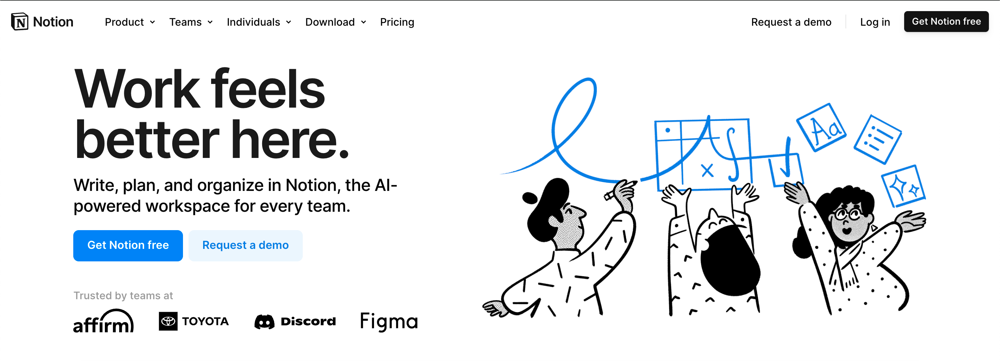
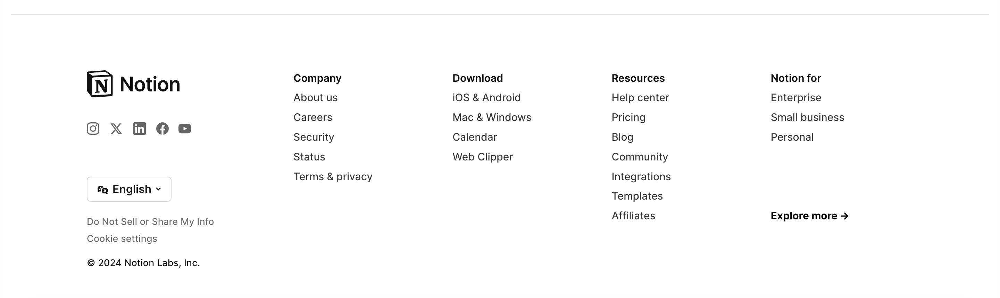
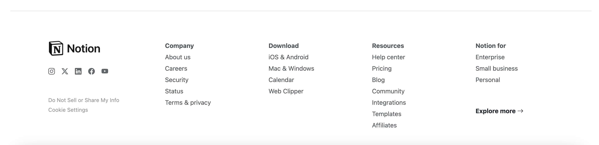

## HTML/CSS

My first computer science class was a course called "Introduction to Web Design" that I took back in high school. I remember going to that class was my favorite part of the day and I enjoyed it so much that I ended up taking another web design course. My favorite part was being able to design websites, I was so immersed in HTML/CSS and loved being creative in literally any way I wanted. In ICS 314 (Software Engineering 1), we recently started learning about HTML/CSS and it reminded me why I loved this language so much. It is a breath of fresh air to be creative again and make whatever I want. 

## Notion

The most recently tasked assignment was to find any website that doesn't use Bootstrap and to recreate it using Bootstrap. I really liked this assignment because we were able to pick any website that we wanted that fit that criteria. I chose the website Notion. It is an application that allows the user to do a lot of different things, but it is primarily advertised as a note-taking app.

I chose to recreate Notion because I like the UI of their website; it is very simple and modern. I think it is also very user-friendly and straightforward to use. I decided to recreate the top section of the home page and the footer section. Below are photos of the original Notion website and my recreation.

 

#### Original Notion website:

 

 

#### My recreation of the Notion website:

 

 

## Bootstrap v5

I have not previously used Bootstrap, so this is my first time using it. I really like it, I think it is helpful and it makes formatting `div`, for example, way easier. Otherwise, I would have to manually format `div` in the CSS file or throughout the HTML file. Because of this, it also makes the file less cluttered - I noticed that my CSS file is shorter than it would typically be. But you have to assign a lot of different classes to elements, which causes the HTML file to become more cluttered. On another note, I really like the Bootstrap icons. I am familiar with icons and have used them previous to this assignment, but I believe I used Google icons instead of Bootstrap icons. I really like Bootstrap icons - in general, I think icons are fun and cute, they make websites more customized and add that unique "pop".

It would have taken a lot longer to do my Notion recreation if I just used HTML/CSS and did not use Bootstrap. So I am glad I learned about Bootstrap because it is very helpful. Not only did using Bootstrap save me time, it also made me more aware of how I am spacing elements on a webpage and it made me more excited to organize the webpage/elements. Overall, I had fun using Bootstrap, and I would definitely use it for future projects and practice.
