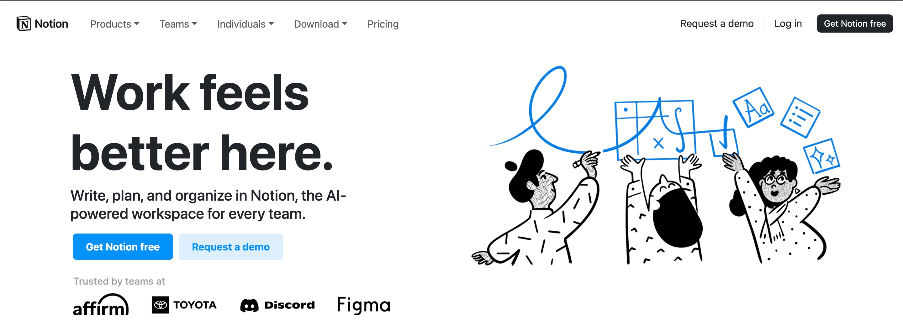

## HTML/CSS

My first computer science class was a course called "Introduction to Web Design" that I took back in high school. I remember going to that class was my favorite part of the day and I enjoyed it so much that I ended up taking another web design course. My favorite part was being able to design websites, I was so immersed in HTML/CSS and loved being creative in literally any way I wanted. In ICS 314 (Software Engineering 1), we recently started learning about HTML/CSS and it reminded me why I loved this language so much. It is a breath of fresh air to be creative again and make whatever I want. 

## Notion

The most recently tasked assignment was to find any website that doesn't use bootstrap and to recreate it using bootstrap. I really liked this assignment because we were able to pick any website that we wanted that fit that criteria. I chose the website Notion. It is an application that allows the user to do a lot of different things, but it is primarily advertised as a note-taking app.

I chose to recreate Notion because I like the UI of their website; it is very simple and modern. I think it is also very user-friendly and straightforward to use. I decided to recreate the top section of the home page and the footer section. Below are photos of the original Notion website and my recreation.

 

#### Original Notion website:

 

 

#### My recreation of the Notion website:

 

 

## Bootstrap v5

text

text
