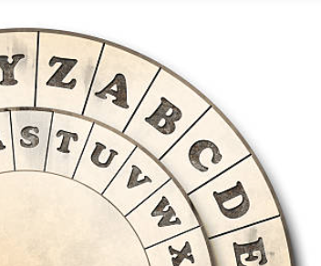
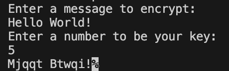

This assignment was from my Computer Science 1 class at Hawai'i Pacific University.

We were asked to create a program that prompts the user to enter a message, along with a key. The program should then print the Caesar cipher encrypted message.

## Caesar Cipher Program Sample

<pre>

  
</pre>

Source: <a href="https://github.com/jogarces/ics-313-text-game"><i class="large github icon "></i>jogarces/ics-313-text-game</a>
