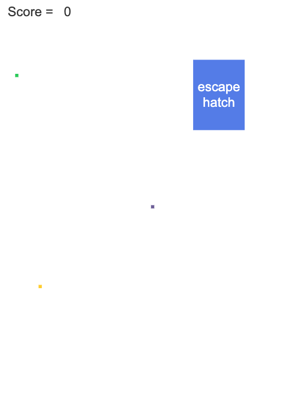
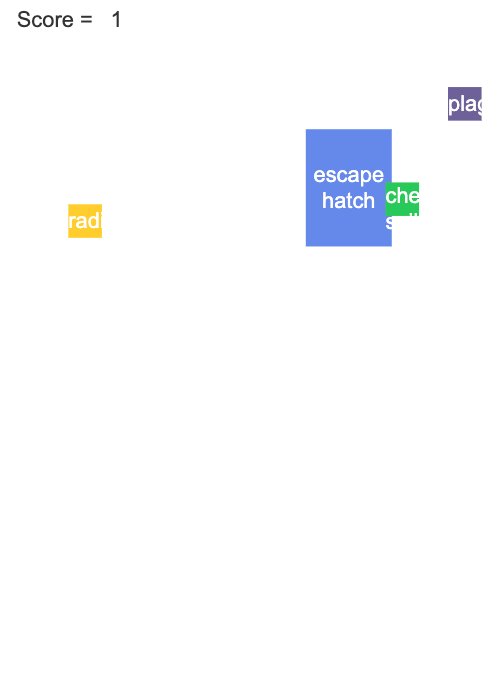
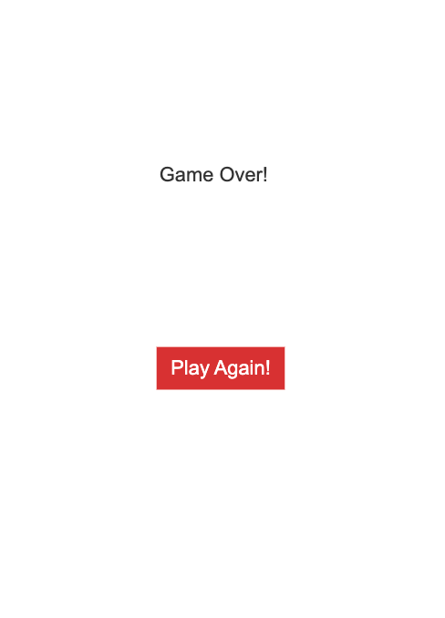

## Background

I did this project in my AP Computer Science Principles class in high school. This was one of the first classes I took, and it introduced me to computer science, and is the reason I am pursuing a degree in this field :)

## Explanation of the Game

The game starts off with a blue box labeled `escape hatch`, which is randomly placed somewhere on the screen. There are also 3 small disaster rectangles that are randomly placed on the screen, and they expand in size when the cursor is moved. If the cursor does not move, the rectangle does not move either. These 3 disaster rectangles are a `chemical spill`, `radiation`, and `plague` - they are indicated by green, yellow, and purple rectangles, respectively. There is also a `Score` indicator in the top left of the screen, this indicated how many escape hatches the user has reached.

The goal of the game is for the user to move their cursor to the `escape hatch` without it touching the `chemical spill`, `radiation`, or `plague`. If the user is able to move the cursor to and click the `escape hatch`, their `Score` will increase by 1, and they will move to the next level, where everything is in a completely different place. If the user's cursor touches one of the disaster rectangles, the game is over, and the user is prompted with a different screen and a `Play Again!` button.

## Samples From the Game

