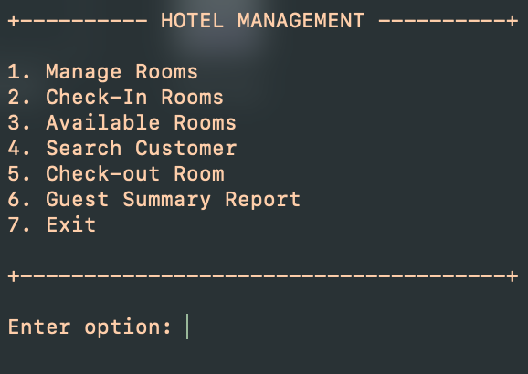

The HMS (Hotel Management System) was developed in order to keep track of rooms in a hotel and to log customers checking in and out of a hotel establishment. The HMS starts off empty; there are no rooms when the HMS is started, therefore rooms must be added through the Manage rooms option shown below.

The HMS allows a user to choose between 6 different options:
  1. Manage rooms
  2. Check-in rooms
  3. Available rooms
  4. Search Customer
  5. Check-out rooms
  6. Guest Summary Report

Manage rooms: displays the MANAGE ROOMS page, where a user can add, search, or delete a room.

Check-in rooms: allows the user to check into the room, prompts user for:
  - Room number
  - Booking ID
  - Customer name
  - Address
  - Phone number
  - Check-in date
  - Check-out date
  - Any advance payments.

Available rooms: displays any available rooms (a room must first be added in the MANAGE ROOMS page and empty to be available).

Search customer: prompts user for customer name, displays if the customer is staying at the hotel or not and the corresponding room number.

Check-out rooms: allows the user to check-out of a room, prompts user for:
  - Room number
  - Number of days stayed in room

    Displays the following check-out details:
    - Customer name
    - Room number
    - Address
    - Phone number
    - Total amound due
    - Advance paid
    - Total payable

Guest summary report: displays all customers currently staying at the hotel, it does not display customers who have checked-out of the hotel.

An excerpt from the HMS is provided below.

<pre>
+---------- HOTEL MANAGEMENT ----------+

1. Manage Rooms
2. Check-In Rooms
3. Available Rooms
4. Search Customer
5. Check-out Room
6. Guest Summary Report
7. Exit

+--------------------------------------+

Enter option: 1

+------------ MANAGE ROOMS ------------+

1. Add Rooms
2. Search Room
3. Delete Room
4. Back to Main Menu

+--------------------------------------+

Enter option: 1

+--------------------------------------+

Room Available to Add!

+ Enter Room Number: 100

+ Type AC/No AC (A/N) : A

+ Type Comfort (S/N) : S

+ Type Size (B/S) : B

+ Daily Rate: 100

Room Added to Hotel Catalog

+------------ MANAGE ROOMS ------------+

1. Add Rooms
2. Search Room
3. Delete Room
4. Back to Main Menu

+--------------------------------------+

Enter option: 2

+--------------------------------------+

+ Enter room number: 100

+------------ ROOM DETAILS ------------+

+ Room Number: 100

+ Type AC/No AC (A/N): A

+ Type Comfort (S/N): S

+ Type Size (B/S): B

+ Daily Rate: 100

+------------ MANAGE ROOMS ------------+

1. Add Rooms
2. Search Room
3. Delete Room
4. Back to Main Menu

+--------------------------------------+

Enter option: 4

+---------- HOTEL MANAGEMENT ----------+

1. Manage Rooms
2. Check-In Rooms
3. Available Rooms
4. Search Customer
5. Check-out Room
6. Guest Summary Report
7. Exit

+--------------------------------------+

Enter option: 3

+---- PRINTING ALL AVAILABLE ROOMS ----+

+ Room Number: 100
+ Type AC/No AC (A/N): A
+ Type Comfort (S/N): S
+ Type Size (B/S): B
+ Daily Rate: 100

+---------- HOTEL MANAGEMENT ----------+

1. Manage Rooms
2. Check-In Rooms
3. Available Rooms
4. Search Customer
5. Check-out Room
6. Guest Summary Report
7. Exit

+--------------------------------------+

Enter option: 2

+--------------------------------------+

+ Press 0 to exit to main menu

+ Enter Room number: 100

+ Enter Booking ID: 1234

+ Enter Customer Name (First Name): John

+ Enter Address (city only): Honolulu

+ Enter Phone: 1112223333

+ Check-in Date: 1/12/2023

+ Check-out Date: 1/24/2023

+ Enter Advance Payment: 150

Customer Checked-in Successfully...

+---------- HOTEL MANAGEMENT ----------+

1. Manage Rooms
2. Check-In Rooms
3. Available Rooms
4. Search Customer
5. Check-out Room
6. Guest Summary Report
7. Exit

+--------------------------------------+

Enter option: 3

+---- PRINTING ALL AVAILABLE ROOMS ----+

No rooms available!

Returning back to Main Menu...

+---------- HOTEL MANAGEMENT ----------+

1. Manage Rooms
2. Check-In Rooms
3. Available Rooms
4. Search Customer
5. Check-out Room
6. Guest Summary Report
7. Exit

+--------------------------------------+

Enter option: 6

+----------- GUEST SUMMARY ------------+

+ Name: John
+ Room number: 100
+ Address: Honolulu
+ Phone number: 1112223333

+---------- HOTEL MANAGEMENT ----------+

1. Manage Rooms
2. Check-In Rooms
3. Available Rooms
4. Search Customer
5. Check-out Room
6. Guest Summary Report
7. Exit

+--------------------------------------+

Enter option: 5

+--------------------------------------+

+ Enter room number: 100

+ Enter number of days: 2

+---------- CHECKOUT DETAILS ----------+

+ Customer name: John

+ Room number: 100

+ Address: Honolulu

+ Phone number: 1112223333

+ Total amount due: $200

+ Advance paid: $150

+ Total Payable: $50

Checkout completed successfully.

+---------- HOTEL MANAGEMENT ----------+

1. Manage Rooms
2. Check-In Rooms
3. Available Rooms
4. Search Customer
5. Check-out Room
6. Guest Summary Report
7. Exit

+--------------------------------------+

Enter option: 7

+--------------------------------------+

THANK YOU! FOR USING SOFTWARE

+--------------------------------------+
</pre>

