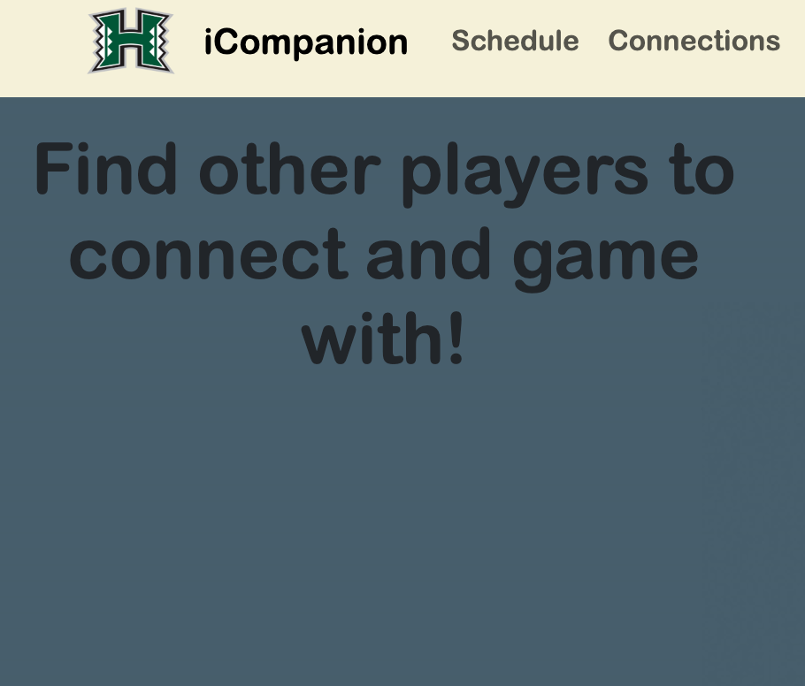
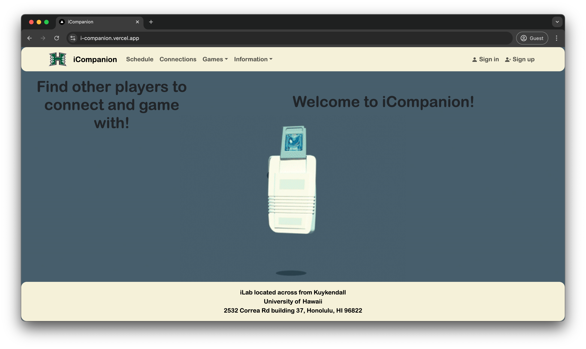
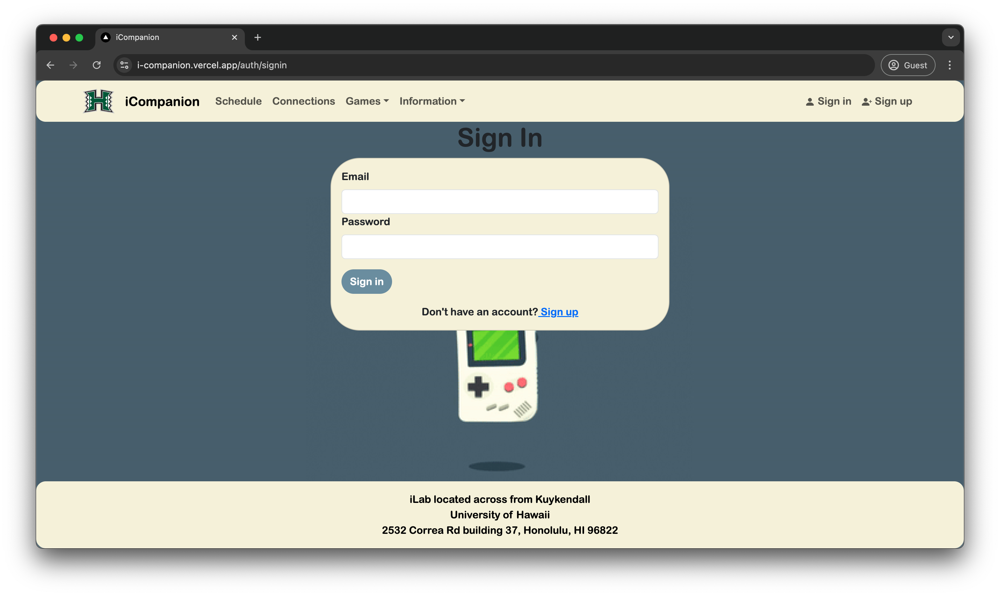
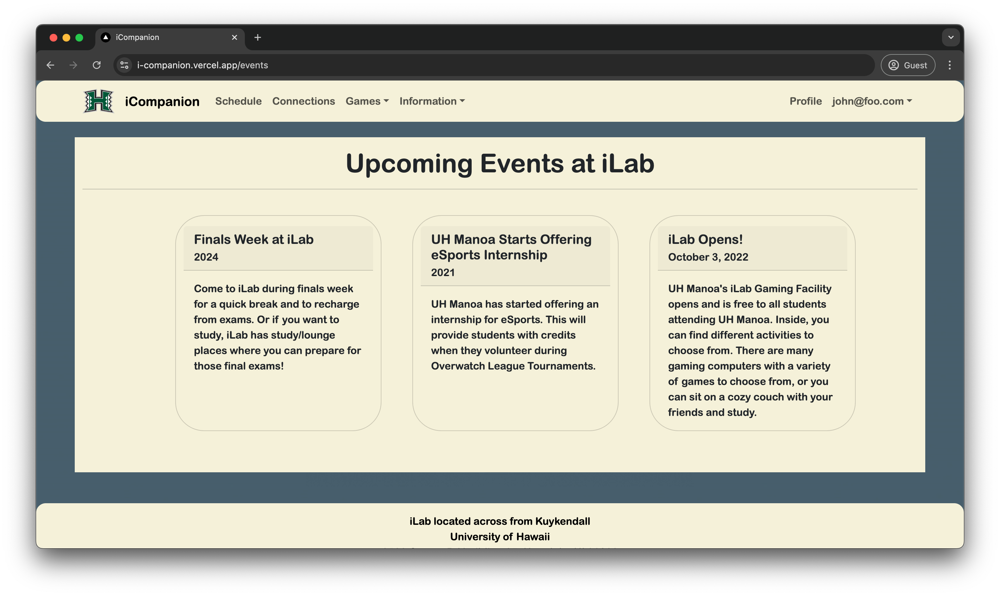

https://i-companion.github.io/iCompanion.github.io/

 

 

## Overview 

This application was developed as the final exam in my ICS 314 (Software Engineering 1) class in 2024. I helped develop it with 3 other classmates. iLab is a small gaming center in the heart of UH Manoa's campus. The goal of this application was to provide iLab a companion application. We wanted students to be able to use iCompanion to connect with others who have similar gaming interests - this way they could meet and play at iLab.

## Contributions

I worked on the following:
- Available Games at the iLab: This page shows all games that you can play at iLab
- Upcoming Events: This page shows all events that were connected to iLab or any current events happening at iLab
- About iLab: This page shows how to find iLab and hours
- Database connection: I helped connect to the database in order to store/retrieve data

## What I Learned

I learned a lot when working on iCompanion, like communication and developing alongside a team. I thought that this was a great experience to work with other people and collaborate on a project. I learned more about using coding standards in order to keep the code more efficient and organized. I also learned a lot about React, PostgreSQL, TypeScript. This project was a great introduction into full stack development. I think the hardest thing to work on was trying to connect and store/retrieve data from the database, and I would really like to learn more about connecting to a database with an application in the future - It seems very important and useful, and you can do a lot of different things by connecting to a database.

[Link to GitHub page for iCompanion](https://i-companion.github.io/iCompanion.github.io/)

## Samples of iCompanion

